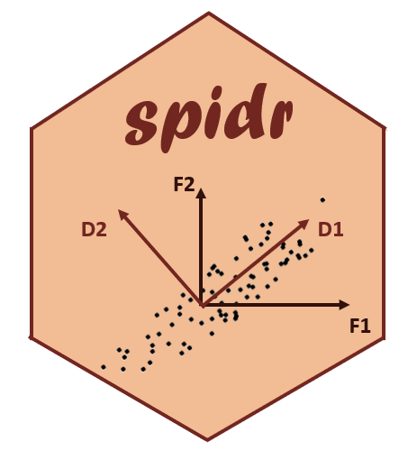

<!-- README.md is generated from README.Rmd. -->

#  Subsampling of Plankton Imagery Datasets and Reprojection in a morphospace 

<!-- badges: start -->

  

<!-- badges: end -->

This project presents a worflow to process morphological features of phytoplankton imagery in order to extract the main **morphological variations**. Although it was developped to analyze 110,000,000 images from an Imaging FlowCytobot(IFCB), the principles could be applicable to any plankton (or not!) imagery dataset. 

You can find a detailed tutorial with an example illustrating this workflow using IFCB data here: https://virginiesonnet.github.io/spidr/

This repository and the MAPI repository (Morphological Analysis of Plankton Imagery) support the article *Size, width, shape regularity, and chains: time series analysis of phytoplankton morphology from imagery in Narragansett Bay* by Sonnet et al. (2022).

## Overview

The projection of every image in a morphospace requires 3 steps: 

1. Subsampling  an adequate number of images to avoid losing too much resolution in the variations but reduce the computing power
2. Creating a morphospace with the subsampled images using a Principal Component Analsis (PCA)
3. Reprojecting all images within that morphospace using the Singular Value Decomposition matrix (SVD) from the PCA  

## Pre-requisites 

The scripts assume access to a database but could be modified depending on the storage method. 
The queries will have to be modified following the database structure. 
All the scripts and functions are in the `scripts/` folder.

A very short subset of the dataset we used in the paper is provided as an example in the `data/` folder. The other CSV files are output examples or other data from the database needed for the different steps of the code (e.g.: concentration per sample, minimum per variable, etc). 

## Development 

The idea of a morphospace with PCA from plankton imagery come from  **Jean-Olivier Irisson** and **Sakina-Dorothee Ayata** (Laboratoire d'Oceanographie de Villefranche-sur-Mer, Sorbonne Universite). 

The subsampling methodology to deal with large datasets and the code presented here were developped by **Virginie Sonnet** (Graduate School of Oceanography, University of Rhode Island). 

